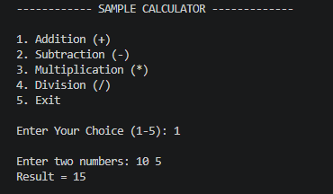
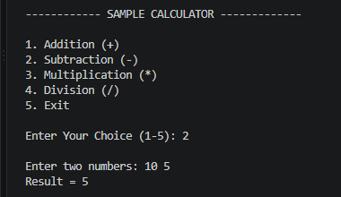
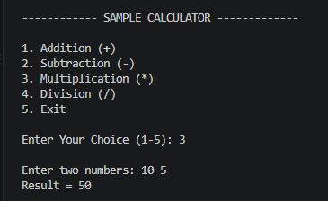
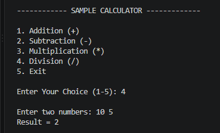
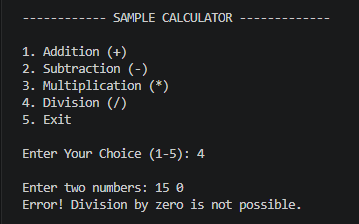
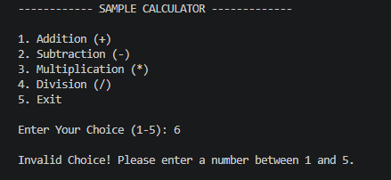

# 🧮 Simple Calulator in C 

A simple menu-driven calculator program written in C language.
It performs basic arithmetic operations such as Addition , Subtraction , Multiplication and Division.

📌 Features 
- Addition of two numbers.  
- Subtraction of two numbers. 
- Multiplication of two numbers. 
- Division of two numbers.
- Handles division by zero.
- Menu-driven protgram using "switch-case".
- Runs continuously until the user selects Exit.

🛠 Concepts Used 
This project demonstrates the following C programming concepts :-
- Variables 
- `printf()` and  `scanf()` 
- `do-while` loop
- `switch-case`
- `if-else` statement
- Arithmetic operators 
- User input and output 

💡 How It Works
1. The program displays a menu with five options.
2. The user enters a choice from 1 to 5.
3. The `switch-case` statement performs the selected operation.
4. For options 1-4 , the program takes two numbers as input.
5. In division , the program checks whether the second number is zero to prevent division by zero.
6. The calculator continues running until the user selects 5 (Exit).

▶ How to Run

### Compile
```bash
gcc calculator.c -o calculator 
```
  
### Run 
```bash 
./calculator 
```

📸 Output Screenshots

### 1. Addition (+) Result 


### 2. Subtraction (-) Result


### 3. Multiplication (*) Result


### 4. Division (/) Result


### 5. Division by zero Error Handling


### 6. Invalid Input Handling (Default Case)


📚 What I Learned
Through this project , I practiced using loops, switch-case, conditional statements, function like `printf()` and `scanf()` and arithmetic operations in C.

👩‍💻 Author
**Pragya Rathore**
